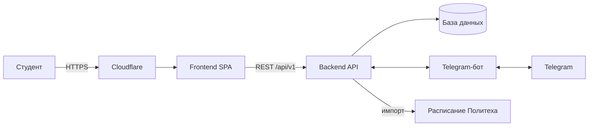

# Архитектура nexoraPoly

## Компоненты

| Компонент | Назначение |
|---|---|
| Frontend | Одностраничное приложение: расписание, задания, предметы, группы, настройки |
| Backend API | REST API с префиксом `/api/v1`, бизнес-логика, авторизация |
| Telegram-бот | Вход в приложение, доставка уведомлений и дайджестов |
| Импорт расписания | Периодическая загрузка расписания групп из источников университета |

## Стек

| Слой | Технологии |
|---|---|
| Frontend | React, Vite, Tailwind CSS, TanStack Query, dnd-kit, date-fns |
| Backend | *заполнить: язык, фреймворк, СУБД* |
| Инфраструктура | Cloudflare (DNS, proxy), *заполнить: хостинг, способ деплоя* |

## Авторизация

1. Клиент вызывает `POST /auth/telegram/init` и получает ссылку на бота.
2. Пользователь подтверждает вход в боте.
3. Клиент опрашивает `GET /auth/telegram/poll/{id}` и получает токены.
4. Обновление токена — `POST /auth/refresh`, выход — `POST /auth/logout`.

`POST /auth/dev` доступен только в режиме разработки и в production возвращает `403`.

## API (`/api/v1`)

| Группа | Эндпоинты |
|---|---|
| Auth | `/auth/telegram`, `/auth/telegram/init`, `/auth/telegram/poll/{id}`, `/auth/refresh`, `/auth/logout`, `/auth/dev` |
| Пользователь | `/users/me`, `/users/me/data` |
| Группы | `/groups`, `/groups/my` |
| Расписание | `/schedule`, `/schedule/override`, `/schedule/overrides/my` |
| Предметы | `/subjects` |
| Задания | `/tasks`, `/tasks/bulk`, `/assignments` |
| Уведомления | `/notifications`, `/notifications/read-all`, `/notifications/settings` |

Полная спецификация — OpenAPI-схема бэкенда (*добавить ссылку*).

## Роли и права

| Роль | Права |
|---|---|
| Студент | Чтение расписания группы, личные задания, голосование по групповым заданиям |
| Модератор | Права студента + управление групповыми заданиями |
| Староста | Права модератора + подтверждение участников и назначение ролей |

Первый вступивший в группу становится старостой — см. задачу по верификации старост в [roadmap](roadmap.md).

## Уведомления

| Тип | Когда |
|---|---|
| Изменения расписания | Отмена пары, смена аудитории |
| Новые задания | Кто-то в группе создал задание |
| Дедлайны | За день до срока |
| Голосования | Новое задание ждёт подтверждения |
| Дайджест | Сводка на завтра, 21:00 |
